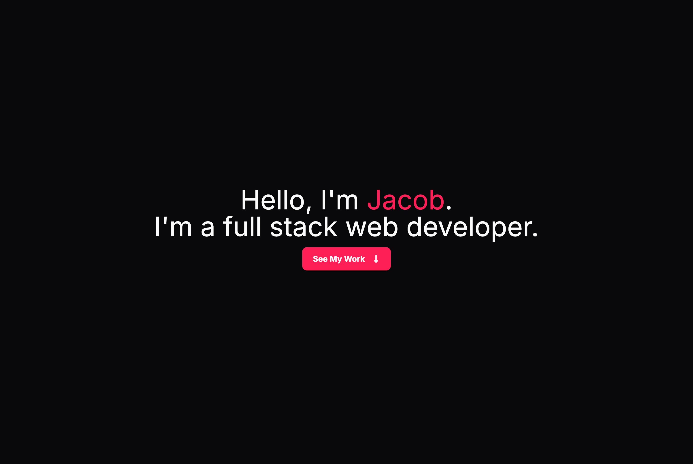
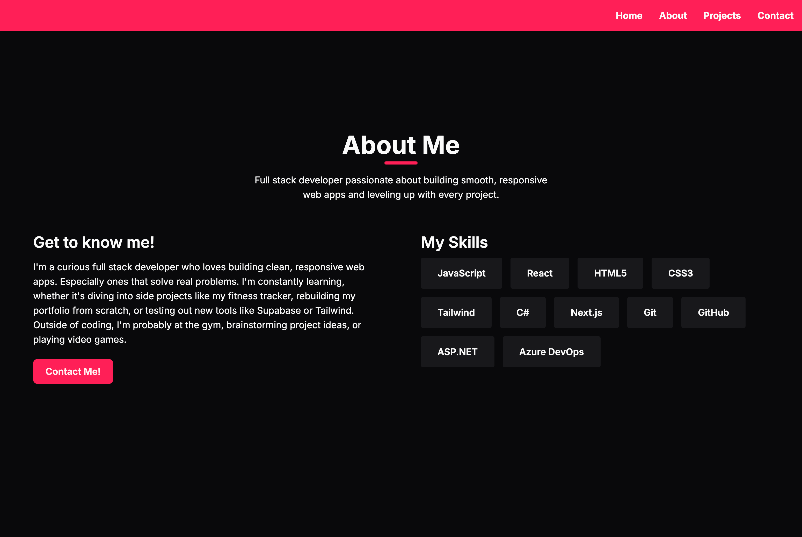
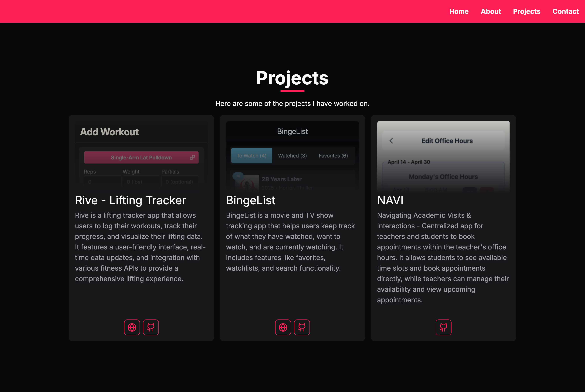
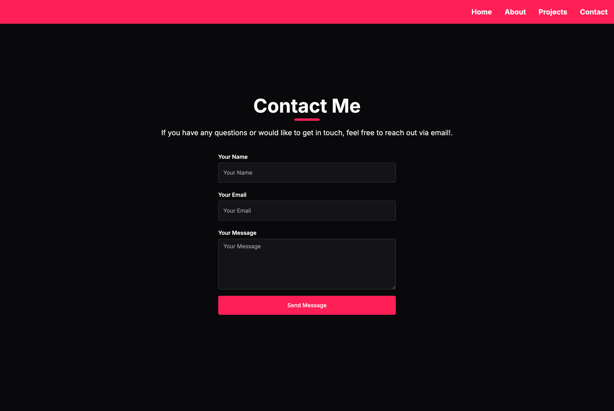

# 🧑‍💻 Jacob Morency — Developer Portfolio

My personal portfolio site, built to showcase my work, skills, and contact information. It’s clean, responsive, and built using modern tools I love working with.

## 🌐 Live Site

[jacobmorency.dev](https://jacobmorency.dev)

## 💻 Tech Stack

- [Next.js 14](https://nextjs.org/)
- [Tailwind CSS](https://tailwindcss.com/)
- [TypeScript](https://www.typescriptlang.org/)
- [Lucide Icons](https://lucide.dev/)

## 📸 Preview

  
Click to View Screenshots

### Home Page

### About Section

### Projects Section

### Contact Section

## 🎯 Goals

- Build a stylish, responsive portfolio from scratch using Tailwind and Next.js
- Practice scroll-snapping layouts and smooth section transitions
- Keep the UI minimal and readable across devices

## 🔗 Connect With Me

- [LinkedIn](https://linkedin.com/in/jacob-morency)
- [Resume PDF](./jacob_morency_resume.pdf)
- [Email Me](mailto:jvmorency@gmail.com)
